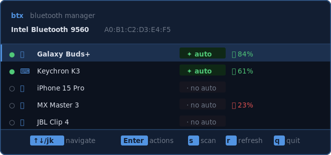

# btx

> Terminal Bluetooth manager for Linux — connect, pair, and manage devices from the keyboard.

[](https://github.com/SubNader/btx/releases)
[](#)
[](https://github.com/SubNader/btx)



## Features

- **Connect / disconnect / pair** devices interactively
- **Toggle autoconnect** — mark devices as trusted; they reconnect at every login
- **Battery level** and **signal strength** display
- **Scan** for nearby unpaired devices
- **`btx-connect`** — headless startup service that connects all trusted devices automatically

## Install

```sh
curl -fsSL https://github.com/SubNader/btx/releases/latest/download/install.sh | sh
```

Installs `btx` and `btx-connect` to `~/.local/bin` and enables the startup service. Supports x86\_64 and aarch64.

**From a release `.deb`** (system-wide):

```sh
curl -LO https://github.com/SubNader/btx/releases/latest/download/btx_<version>_amd64.deb
sudo dpkg -i btx_<version>_amd64.deb
```

**From source:**

```sh
git clone https://github.com/SubNader/btx
cd btx
./setup.sh
```

Requires: Rust toolchain, `bluetoothd` running, D-Bus system bus access.

## Usage

```sh
btx
```

The TUI opens immediately and loads all known Bluetooth devices. The adapter name and address are shown in the header. Each row shows the device icon, connection state (`●` connected / `○` disconnected), name, autoconnect status, signal bars, and battery level where available.

### Keys

| Key | Action |
|-----|--------|
| `↑` `↓` / `j` `k` | Navigate the device list |
| `Enter` / `Space` | Open the action menu for the selected device |
| `s` | Scan for nearby devices |
| `r` | Refresh the device list |
| `q` / `Esc` | Quit (or close the current popup) |

### Action menu

Press `Enter` or `Space` on any device to open its action menu. Available actions depend on device state:

| Action | When available | Description |
|--------|---------------|-------------|
| 🔗 Connect | Paired, disconnected | Connect the device |
| ⏏️ Disconnect | Paired, connected | Disconnect the device |
| 🤝 Pair | Not yet paired | Pair a new device |
| ✦ Toggle autoconnect | Paired | Mark/unmark as trusted for startup reconnect |
| 🗑️ Remove / unpair | Paired | Forget the device — must re-pair to use again |

All actions show a confirmation prompt (`y` / `Enter` to confirm, `n` / `Esc` to cancel).

### Pairing a new device

1. Put the device into pairing mode.
2. Press `s` in btx to start scanning — nearby unpaired devices appear in the list as they are discovered.
3. Navigate to the device and press `Enter` → **Pair**.
4. After pairing, optionally press `Enter` → **Toggle autoconnect** so it reconnects at every login.
5. Press `Esc` or `q` to stop scanning.

## Startup connect

`btx-connect` runs at login as a systemd user service and connects all trusted devices automatically.

```
● btx-connect: connecting Galaxy Buds+ (E5CF) (34:82:C5:D4:E5:CF) … ok
● btx-connect: connecting Keychron K3 (AA:BB:CC:DD:EE:FF) … ok
```

```sh
# Check logs
journalctl --user -u btx-connect.service

# Disable
systemctl --user disable btx-connect.service
```

Mark a device as trusted from within `btx` using **Toggle autoconnect**.

## Uninstall

```sh
systemctl --user disable --now btx-connect.service
rm ~/.local/bin/btx ~/.local/bin/btx-connect
rm ~/.config/systemd/user/btx-connect.service
systemctl --user daemon-reload
```
